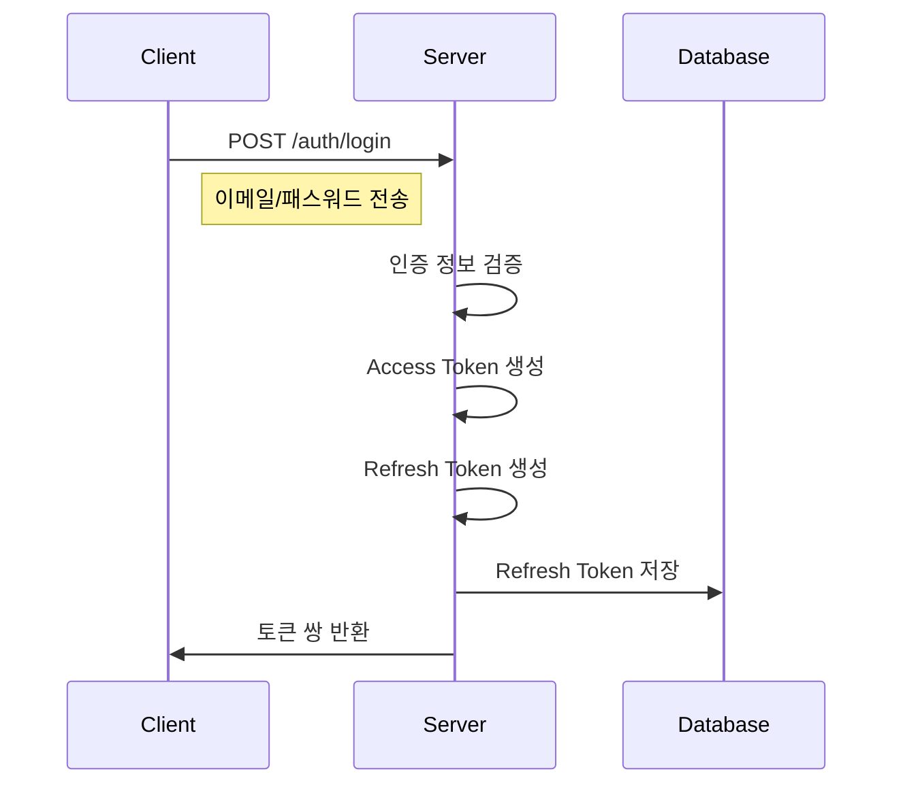

# 토큰 발급 과정

## 최초 로그인




### 1. 클라이언트가 로그인 요청

```http
POST /auth/login
Content-Type: application/json

{
    "email": "user@example.com",
    "password": "hashedPassword"
}
```

### 2. 서버 응답

```json
{
    "status": "success",
    "data": {
        "accessToken": "eyJhbG...",
        "refreshToken": "eyJhbG...",
        "expiresIn": 7200,
        "tokenType": "Bearer"
    }
}
```

***

## API 요청 시 인증

```http
GET /api/v1/properties
Authorization: Bearer eyJhbG...
```
