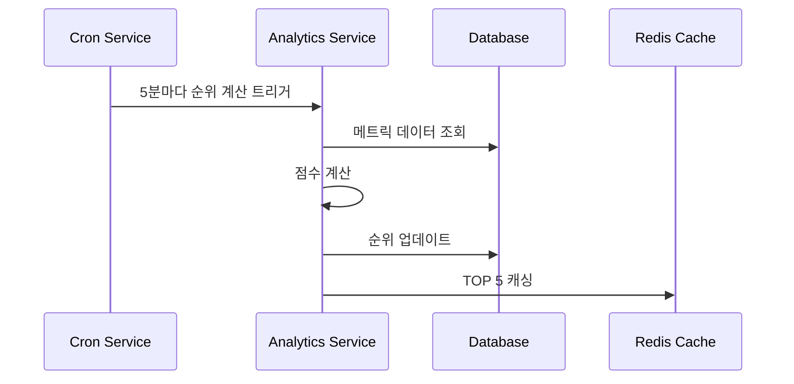

# HOT 매물 산정 방식

## 점수 계산 공식

```json
{
  "scoring_factors": {
    "view_count": {
      "weight": 0.3,
      "decay_factor": "24시간당 10% 감소",
      "calculation": "로그 스케일 적용(log10)"
    },
    "like_count": {
      "weight": 0.25,
      "decay_factor": "없음",
      "calculation": "실제 값"
    },
    "disadvantage_view": {
      "weight": 0.2,
      "decay_factor": "없음",
      "bonus": "열람당 +5점"
    },
    "interaction_rate": {
      "weight": 0.15,
      "calculation": "(좋아요 + 문의) / 조회수"
    },
    "freshness": {
      "weight": 0.1,
      "decay_factor": "7일당 20% 감소"
    }
  }
}
```

***

## 순위 갱신 프로세스



***

## 시간대별 가중치

```json
{
  "time_weights": {
    "peak_hours": {
      "hours": ["09:00-18:00"],
      "weight_multiplier": 1.2
    },
    "off_peak": {
      "hours": ["18:00-23:00", "06:00-09:00"],
      "weight_multiplier": 1.0
    },
    "night": {
      "hours": ["23:00-06:00"],
      "weight_multiplier": 0.8
    }
  }
}
```
