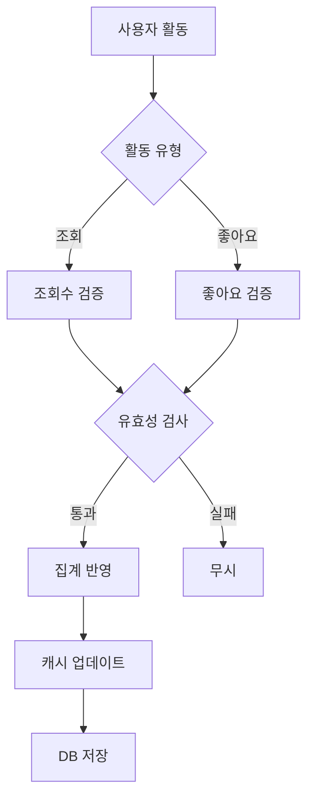

# 조회수/좋아요 집계 방식

## 조회수 집계 규칙

```json
{
  "view_counting_rules": {
    "unique_view": {
      "definition": "동일 사용자 24시간 내 1회만 집계",
      "identification": ["user_id", "session_id", "ip_address"]
    },
    "valid_view": {
      "minimum_duration": "10초",
      "scroll_depth": "30% 이상",
      "excluded": ["bot", "crawler"]
    },
    "bot_detection": {
      "user_agent_check": true,
      "behavior_analysis": true,
      "rate_limiting": "IP당 분당 30회"
    }
  }
}
```

***

## 좋아요 집계 규칙

```json
{
  "like_counting_rules": {
    "authentication": "로그인 필수",
    "duplicate_prevention": {
      "same_user": "매물당 1회",
      "cool_down": "취소 후 재좋아요 24시간 제한"
    },
    "validation": {
      "minimum_view_time": "30초",
      "bot_protection": true
    }
  }
}
```

***

## 데이터 집계 프로세스



