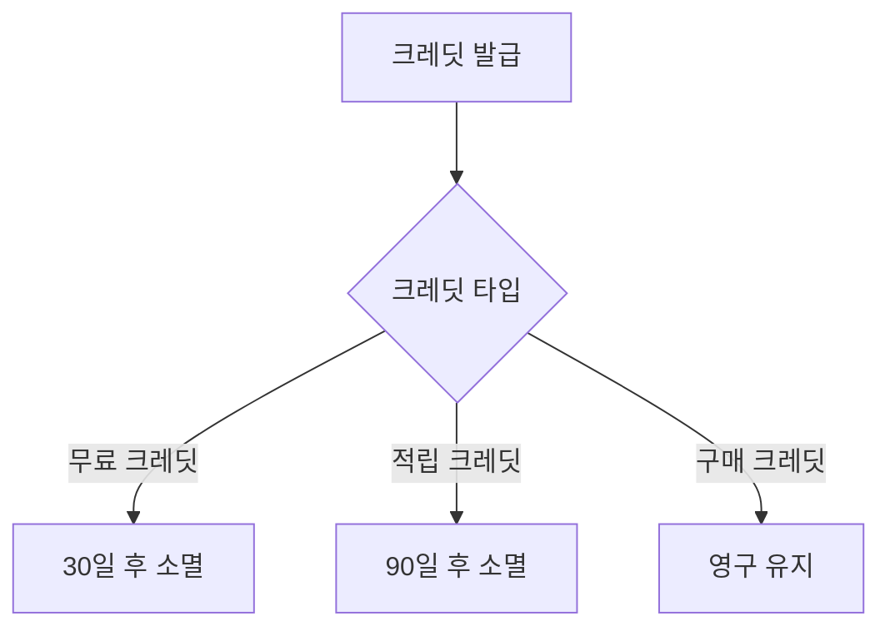

# 적립/사용 규칙

## 크레딧 적립 조건

### 1. 매물 관련 적립

```json
{
  "property_credits": {
    "hot_property_selection": {
      "daily": 50,
      "weekly": 100,
      "monthly": 200
    },
    "property_view": {
      "per_unique_view": 1,
      "daily_cap": 100
    },
    "successful_transaction": 500
  }
}
```

### 2. 활동 관련 적립

```json
{
  "activity_credits": {
    "first_registration": 100,
    "profile_completion": 50,
    "referral": {
      "referrer": 100,
      "referee": 50
    },
    "daily_login": 5
  }
}
```

***

## 크레딧 사용 규칙

<table><thead><tr><th width="216">기능</th><th>필요 크레딧</th><th>설명</th></tr></thead><tbody><tr><td>아사단 열람</td><td>30</td><td>매물당 1회</td></tr><tr><td>AI 분석 리포트</td><td>50</td><td>매물당 1회</td></tr><tr><td>매물 우선 노출</td><td>100</td><td>7일간 유지</td></tr><tr><td>프리미엄 검색</td><td>20</td><td>24시간 이용</td></tr></tbody></table>

***

## 크레딧 소멸 규칙



