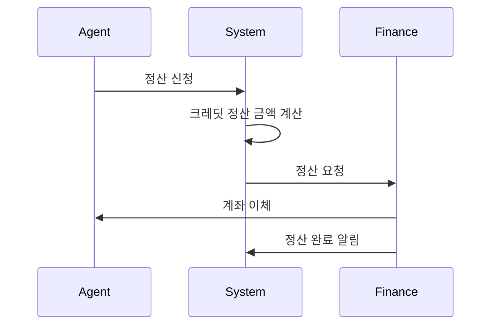

# 정산 프로세스

## 중개사 정산 프로세스



***

## 정산 규칙

```json
{
  "settlement_rules": {
    "minimum_amount": 50000,
    "credit_to_cash": "1크레딧 = 100원",
    "settlement_period": "매월 1일",
    "payment_deadline": "신청 후 7영업일 이내",
    "tax_info": {
      "vat": "10%",
      "income_tax": "3.3%"
    }
  }
}
```

***

## 정산 상태 관리

<table><thead><tr><th width="198">상태</th><th>설명</th><th>처리 기한</th></tr></thead><tbody><tr><td>REQUESTED</td><td>정산 신청됨</td><td>-</td></tr><tr><td>REVIEWING</td><td>검토 중</td><td>1영업일</td></tr><tr><td>APPROVED</td><td>승인됨</td><td>-</td></tr><tr><td>PROCESSING</td><td>이체 중</td><td>3영업일</td></tr><tr><td>COMPLETED</td><td>정산 완료</td><td>-</td></tr><tr><td>REJECTED</td><td>거절됨</td><td>-</td></tr></tbody></table>
