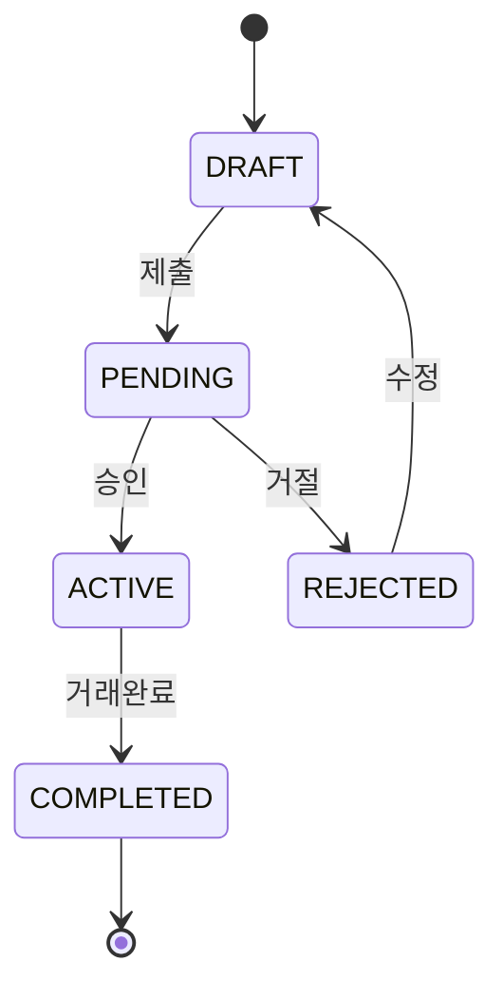

# 매물 상태 관리

## 상태 전이도

***

## 상태별 기능 제한

| 상태        | 수정 가능 | 조회 가능 | 삭제 가능 |
| --------- | ----- | ----- | ----- |
| DRAFT     | ✅     | ❌     | ✅     |
| PENDING   | ❌     | ✅     | ✅     |
| ACTIVE    | ⚡️    | ✅     | ❌     |
| REJECTED  | ✅     | ❌     | ✅     |
| COMPLETED | ❌     | ✅     | ❌     |

> ⚡️ : 일부 필드만 수정 가능
