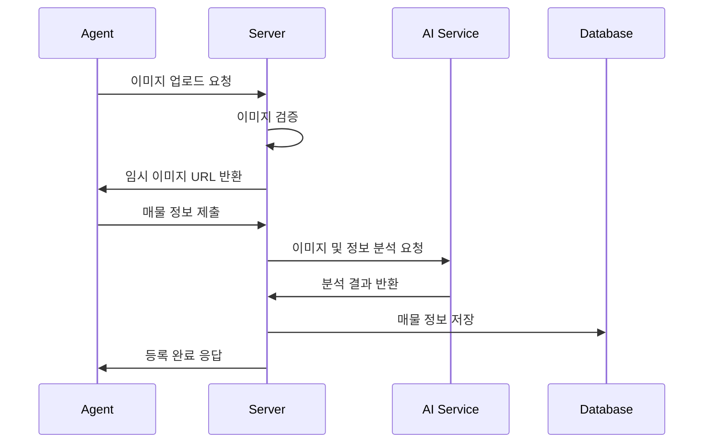

# 매물 등록 프로세스

## 등록 플로우



***

## 필수 입력 정보

```json
{
  "required_fields": {
    "basic_info": {
      "title": "매물 제목",
      "property_type": "업종 구분",
      "address": "주소",
      "size": "면적(m²)",
      "floor": "층수"
    },
    "price_info": {
      "deposit": "보증금",
      "monthly_rent": "월세",
      "maintenance_fee": "관리비",
      "premium": "권리금"
    },
    "additional_info": {
      "business_hours": "영업시간",
      "parking": "주차 정보",
      "facilities": "시설 정보"
    },
    "disadvantages": {
      "minor_issues": "아사단 (20단어 이상)"
    }
  }
}
```

***

## 유효성 검사 규칙

### 1. 기본 정보 검증

* 제목: 특수문자 제한, 최대 50자
* 주소: 도로명 주소 형식 검증
* 면적: 최소 1m², 소수점 첫째 자리까지

### 2. 가격 정보 검증

* 보증금: 0원 이상
* 월세: 0원 이상
* 권리금: 숫자만 입력

***

## 매물 등록 상태 코드

| 상태 코드     | 설명    | 다음 단계           |
| --------- | ----- | --------------- |
| DRAFT     | 임시 저장 | PENDING         |
| PENDING   | 검토 대기 | ACTIVE/REJECTED |
| ACTIVE    | 활성화   | COMPLETED       |
| REJECTED  | 거절됨   | DRAFT           |
| COMPLETED | 거래 완료 | -               |
