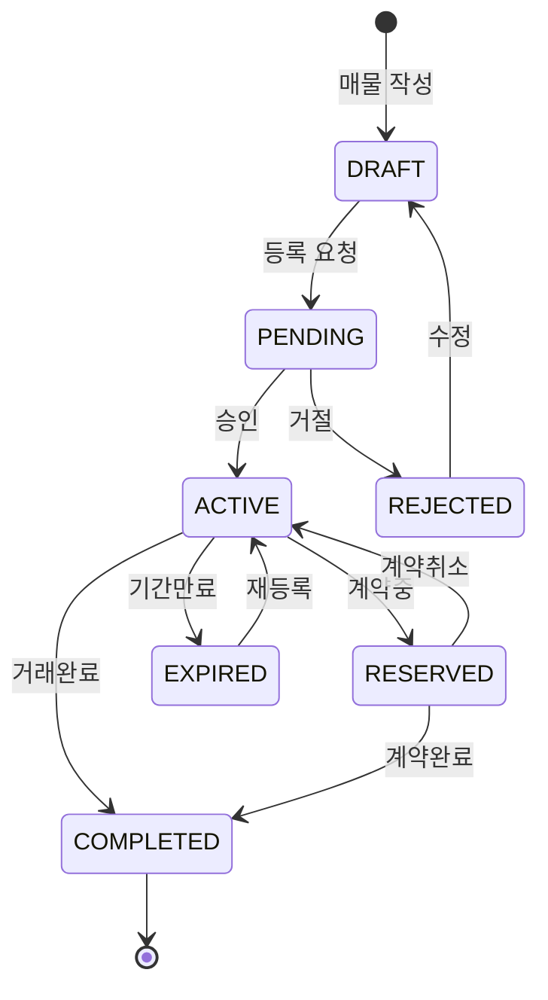

# 상태 전이도

## 기본 상태 전이

***

## 상태별 특성

| 상태        | 설명    | 가능한 작업     | 조회 가능 여부 |
| --------- | ----- | ---------- | -------- |
| DRAFT     | 작성 중  | 수정, 삭제, 제출 | 작성자만     |
| PENDING   | 검토 중  | -          | 작성자만     |
| ACTIVE    | 활성화   | 수정, 예약, 완료 | 전체 공개    |
| RESERVED  | 계약 진행 | 취소, 완료     | 전체 공개    |
| COMPLETED | 거래 완료 | -          | 전체 공개    |
| EXPIRED   | 기간 만료 | 재등록        | 작성자만     |
| REJECTED  | 거절됨   | 수정, 삭제     | 작성자만     |
