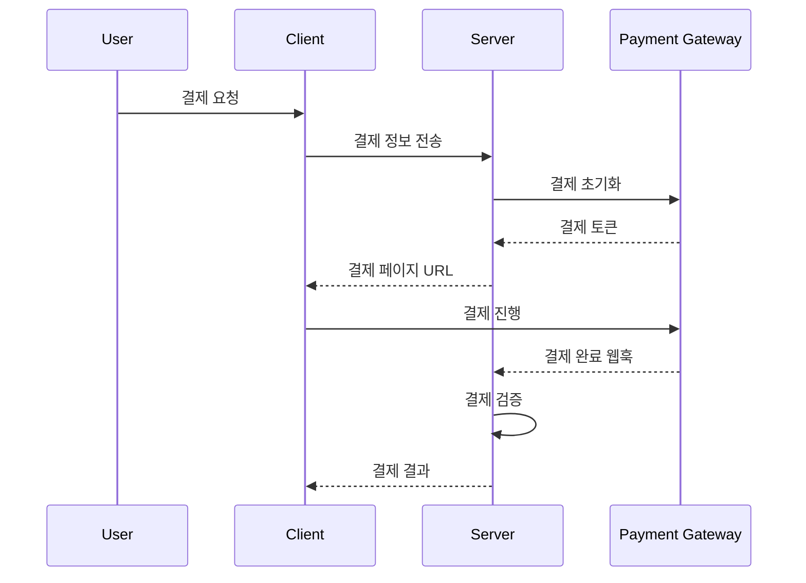

# 결제 시스템 연동

## 결제 프로세스 흐름



***

## PG사 연동 설정

```typescript
interface PaymentConfig {
  // PG사 설정
  provider: 'toss' | 'inicis' | 'kakao';
  merchantId: string;
  apiKey: string;
  secretKey: string;
  
  // 환경 설정
  mode: 'sandbox' | 'production';
  
  // 콜백 URL
  successUrl: string;
  failureUrl: string;
  webhookUrl: string;
}
```

***

## 결제 구현 예시

```javascript
// 결제 초기화
async function initializePayment(paymentData) {
  try {
    const paymentInfo = {
      amount: paymentData.amount,
      orderId: generateOrderId(),
      orderName: `${paymentData.credits} 크레딧`,
      customerName: paymentData.userName,
      successUrl: `${BASE_URL}/payments/success`,
      failureUrl: `${BASE_URL}/payments/failure`,
      webhookUrl: `${BASE_URL}/payments/webhook`
    };
    
    return await paymentGateway.initialize(paymentInfo);
  } catch (error) {
    logger.error('Payment initialization failed:', error);
    throw new PaymentError('INIT_FAILED', error.message);
  }
}
```

