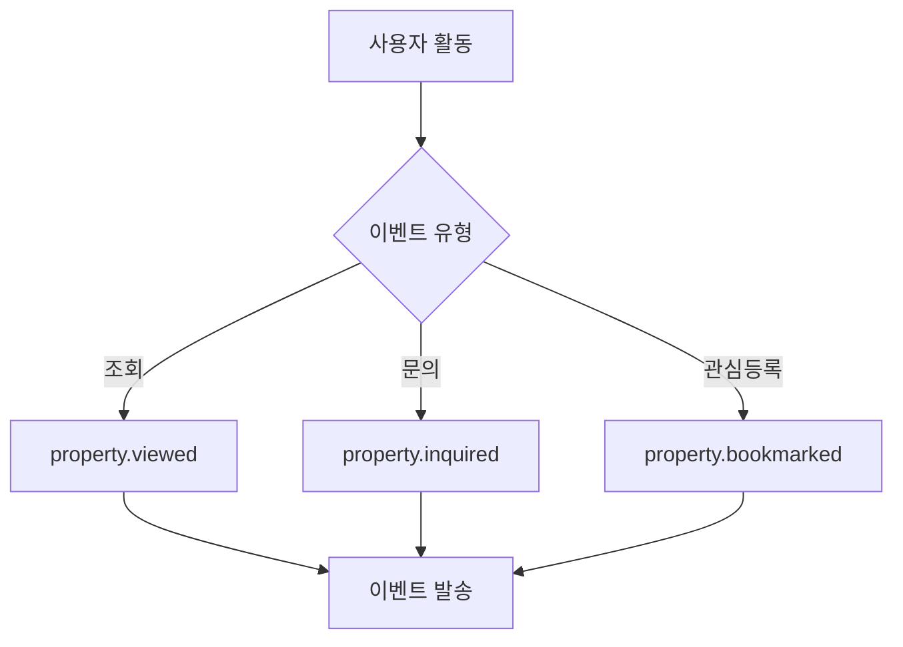

# 이벤트 유형

## 매물 관련 이벤트

```json
{
  "property_events": {
    "property.created": {
      "description": "신규 매물 등록",
      "payload": {
        "propertyId": "prop_123",
        "status": "ACTIVE",
        "agent": {
          "id": "agent_456",
          "name": "김중개"
        },
        "timestamp": "2024-01-04T12:00:00Z"
      }
    },
    "property.updated": {
      "description": "매물 정보 수정",
      "payload": {
        "propertyId": "prop_123",
        "updatedFields": ["price", "description"],
        "timestamp": "2024-01-04T12:00:00Z"
      }
    },
    "property.status_changed": {
      "description": "매물 상태 변경",
      "payload": {
        "propertyId": "prop_123",
        "oldStatus": "ACTIVE",
        "newStatus": "COMPLETED",
        "timestamp": "2024-01-04T12:00:00Z"
      }
    }
  }
}
```

***

## 크레딧 관련 이벤트

```json
{
  "credit_events": {
    "credit.purchased": {
      "description": "크레딧 구매",
      "payload": {
        "userId": "user_789",
        "amount": 1000,
        "transactionId": "tr_123"
      }
    },
    "credit.consumed": {
      "description": "크레딧 사용",
      "payload": {
        "userId": "user_789",
        "amount": 50,
        "purpose": "VIEW_DISADVANTAGE",
        "propertyId": "prop_123"
      }
    }
  }
}
```

***

## 사용자 활동 이벤트



