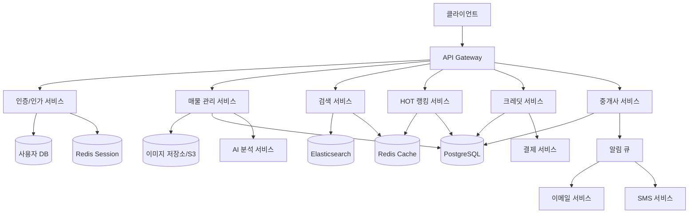
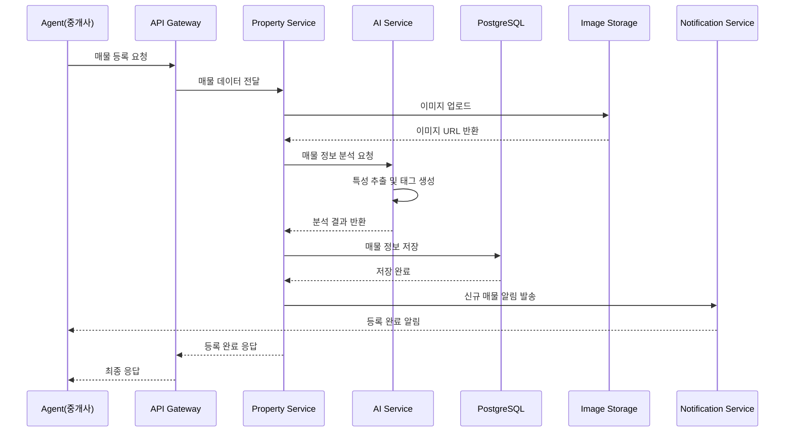

# 시스템 아키텍처

## 주요 특징

* 마이크로 서비스 기반 구조
* 이벤트 기반 통신
* 분산 캐싱 시스템

### 컴포넌트 다이어 그램

#### 시스템의 주요 서비스들과 그들 간의 관계

* API Gateway를 통한 중앙 집중식 접근 제어
* 각 핵심 기능별 마이크로서비스 구조
* 데이터 저장소의 분리 (PostgreSQL, Redis, Elasticsearch)
* 비동기 처리를 위한 메시지 큐 시스템

***

### 시퀀스 다이어 그램

매물 등록 프로세스 흐름

* 중개사의 매물 등록 요청부터 최종 응답까지의 과정
* AI 서비스를 통한 매물 정보 분석
* 비동기 알림 처리
