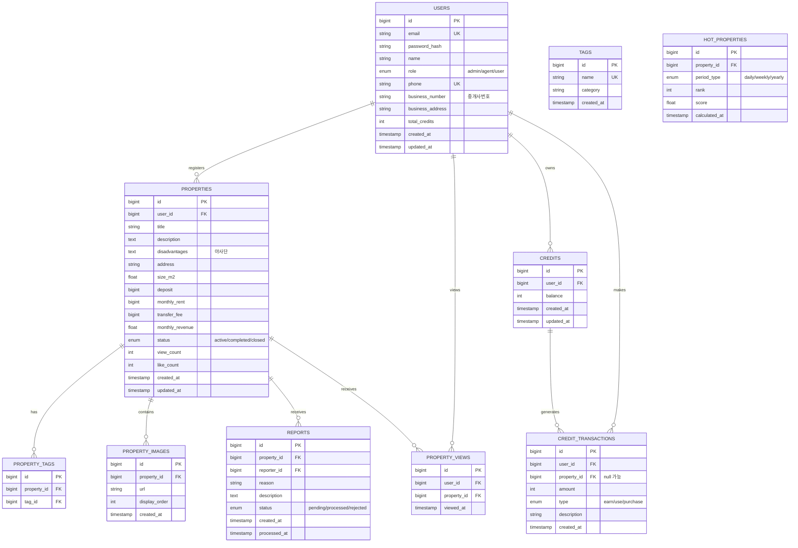

# 데이터베이스 스키마




## 데이터베이스 인덱스 설계

### 1. USERS 테이블

* PRIMARY KEY: `id`
* UNIQUE INDEX: `idx_users_email` (`email`)
* UNIQUE INDEX: `idx_users_phone` (`phone`)
* INDEX: `idx_users_role` (`role`)
* INDEX: `idx_users_business_number` (`business_number`)

### 2. PROPERTIES 테이블

* PRIMARY KEY: `id`
* INDEX: `idx_properties_user` (`user_id`)
* INDEX: `idx_properties_status` (`status`)
* INDEX: `idx_properties_created` (`created_at`)
* COMPOSITE INDEX: `idx_properties_location` (`address`, `status`)
* COMPOSITE INDEX: `idx_properties_metrics` (`view_count`, `like_count`, `status`)
* FULLTEXT INDEX: `idx_properties_search` (`title`, `description`)

### 3. PROPERTY\_IMAGES 테이블

* PRIMARY KEY: `id`
* INDEX: `idx_property_images_property` (`property_id`, `display_order`)

### 4. PROPERTY\_TAGS 테이블

* PRIMARY KEY: `id`
* COMPOSITE INDEX: `idx_property_tags_mapping` (`property_id`, `tag_id`)

### 5. TAGS 테이블

* PRIMARY KEY: `id`
* UNIQUE INDEX: `idx_tags_name` (`name`)
* INDEX: `idx_tags_category` (`category`)

### 6. PROPERTY\_VIEWS 테이블

* PRIMARY KEY: `id`
* COMPOSITE INDEX: `idx_property_views_user_property` (`user_id`, `property_id`)
* INDEX: `idx_property_views_time` (`viewed_at`)

### 7. CREDITS 테이블

* PRIMARY KEY: `id`
* UNIQUE INDEX: `idx_credits_user` (`user_id`)

### 8. CREDIT\_TRANSACTIONS 테이블

* PRIMARY KEY: `id`
* INDEX: `idx_credit_transactions_user` (`user_id`)
* INDEX: `idx_credit_transactions_property` (`property_id`)
* INDEX: `idx_credit_transactions_time` (`created_at`)
* COMPOSITE INDEX: `idx_credit_transactions_type_time` (`type`, `created_at`)

### 9. REPORTS 테이블

* PRIMARY KEY: `id`
* INDEX: `idx_reports_property` (`property_id`)
* INDEX: `idx_reports_reporter` (`reporter_id`)
* INDEX: `idx_reports_status` (`status`)
* INDEX: `idx_reports_created` (`created_at`)

### 10. HOT\_PROPERTIES 테이블

* PRIMARY KEY: `id`
* UNIQUE INDEX: `idx_hot_properties_unique` (`property_id`, `period_type`, `calculated_at`)
* INDEX: `idx_hot_properties_rank` (`period_type`, `rank`)
* INDEX: `idx_hot_properties_time` (`calculated_at`)

### 파티셔닝 전략

1. PROPERTY\_VIEWS 테이블
   * 시간 기반 파티셔닝 (월별)
   * 오래된 조회 데이터의 효율적인 관리를 위함
2. CREDIT\_TRANSACTIONS 테이블
   * 시간 기반 파티셔닝 (월별)
   * 거래 내역의 빠른 조회와 아카이빙을 위함

### 주요 쿼리 최적화 포인트

1.  HOT 매장 조회

    ```sql
    SELECT p.*, h.rank
    FROM properties p
    JOIN hot_properties h ON p.id = h.property_id
    WHERE h.period_type = ? AND h.calculated_at = ?
    ORDER BY h.rank
    LIMIT 5

    ```
2.  지역별 매물 검색

    ```sql
    SELECT p.*, COUNT(pv.id) as view_count
    FROM properties p
    LEFT JOIN property_views pv ON p.id = pv.property_id
    WHERE p.address LIKE ? AND p.status = 'active'
    GROUP BY p.id

    ```
3.  태그 기반 검색

    ```sql
    SELECT p.*
    FROM properties p
    JOIN property_tags pt ON p.id = pt.property_id
    JOIN tags t ON pt.tag_id = t.id
    WHERE t.name IN (?) AND p.status = 'active'

    ```

#### 주요 특징

1. 확장성을 고려한 정규화된 구조
2. 효율적인 검색을 위한 인덱스 설계
3. 대용량 데이터 처리를 위한 파티셔닝 전략
4. 성능 최적화를 위한 복합 인덱스 활용

#### 추가로 고려해야 할 사항

1. 추가적인 테이블이나 필드
2. 특정 쿼리의 성능 최적화
3. 파티셔닝 전략의 조정
4. 새로운 인덱스 추가
